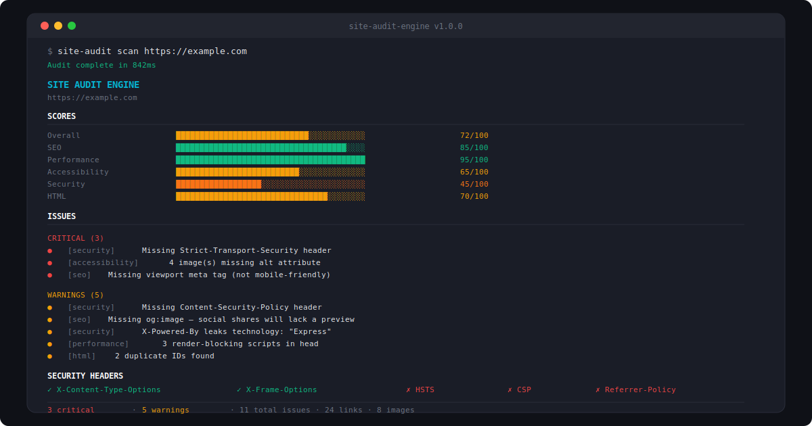

# site-audit-engine

CLI tool to audit any website for SEO, performance, accessibility, security, and HTML issues. One command, full report.



## Install

```bash
npm install -g site-audit-engine

# Or run directly
npx site-audit-engine scan https://example.com
```

## Usage

### Full audit

```bash
# Scan a website
site-audit scan https://example.com

# Export to JSON
site-audit scan https://example.com --output report.json

# Audit only one category
site-audit scan https://example.com --category seo
site-audit scan https://example.com --category security
```

### Security headers only

```bash
site-audit headers https://example.com
```

## What it checks

### SEO
- Title tag (presence, length)
- Meta description (presence, length)
- H1 heading (presence, count)
- Canonical URL
- Open Graph tags (title, description, image)
- Twitter Card
- Viewport meta
- Language attribute
- Heading hierarchy
- Word count / thin content

### Performance
- Response time
- Page size
- Render-blocking scripts
- Image dimensions and lazy loading
- CSS/JS file count
- Inline styles

### Accessibility
- Image alt attributes
- Empty links and buttons
- Form input labels
- Language attribute
- Skip navigation
- ARIA roles validation
- Tab order issues

### Security
- HTTPS
- Strict-Transport-Security (HSTS)
- Content-Security-Policy (CSP)
- X-Frame-Options
- X-Content-Type-Options
- Referrer-Policy
- Permissions-Policy
- Server/X-Powered-By info leak
- Mixed content detection

### HTML
- DOCTYPE declaration
- Character encoding
- Duplicate IDs
- Deprecated tags
- Empty elements
- Link validation

## SDK

```typescript
import { Crawler, SEOAuditor, SecurityAuditor } from "site-audit-engine";

const crawler = new Crawler({ url: "https://example.com" });
const page = await crawler.fetch();

const seo = new SEOAuditor();
const { issues, meta } = seo.audit(page);

console.log(`Title: ${meta.title}`);
console.log(`Issues: ${issues.length}`);
```

## Project Structure

```
src/
├── cli/
│   └── index.ts            # CLI commands (scan, headers)
├── crawler/
│   └── index.ts            # Page fetcher with redirect handling
├── auditors/
│   ├── seo.ts              # SEO checks (title, meta, OG, headings)
│   ├── performance.ts      # Performance checks (size, scripts, images)
│   ├── accessibility.ts    # A11y checks (alt, labels, ARIA)
│   ├── security.ts         # Security headers audit
│   └── html.ts             # HTML validation and link extraction
├── reporters/
│   ├── console.ts          # Terminal output with scores and charts
│   └── json.ts             # JSON export
├── types.ts                # TypeScript interfaces
└── index.ts                # SDK exports
```

## License

MIT — free to use, modify, and distribute.

---

## 🇫🇷 Documentation en français

### Description
site-audit-engine est un outil CLI pour auditer n'importe quel site web en matière de SEO, performance, accessibilité, sécurité et qualité HTML. Une seule commande suffit pour obtenir un rapport complet et détaillé.

### Installation
```bash
npm install -g site-audit-engine

# Ou exécution directe
npx site-audit-engine scan https://exemple.com
```

### Utilisation
```bash
# Audit complet
site-audit scan https://exemple.com

# Export en JSON
site-audit scan https://exemple.com --output rapport.json

# Audit d'une seule catégorie
site-audit scan https://exemple.com --category seo
site-audit scan https://exemple.com --category security
```

Consultez la documentation anglaise ci-dessus pour la liste complète des vérifications effectuées (SEO, performance, accessibilité, sécurité, HTML) et l'utilisation du SDK.

